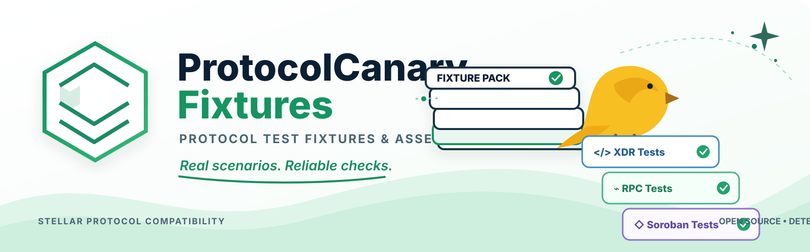

# ProtocolCanary-Fixtures





[](https://github.com/StellarCanary/ProtocolCanary-Fixtures/actions/workflows/validate.yml) [](LICENSE) <!-- fixtures-badge:start -->[](#protocol-packs)<!-- fixtures-badge:end -->

Canonical compatibility fixtures for Stellar Protocol Canary.

[Documentation](https://stellarcanary.github.io/Protocol-Canary/) | [Protocol-Canary](https://github.com/StellarCanary/Protocol-Canary) | [Action](https://github.com/StellarCanary/ProtocolCanary-Action)

## Quick start

The validator requires **Python 3.11 or newer** — it imports `tomllib`,
which only became part of the standard library in Python 3.11. On an
older interpreter it fails immediately with
`ModuleNotFoundError: No module named 'tomllib'`. Nothing else needs to
be installed.

```bash
python3 tools/validate/validate.py    # structural fixture validation
python3 -m unittest discover tests    # repository test suite
```

See [Validation](#validation) below (and
[`CONTRIBUTING.md`](CONTRIBUTING.md#development-setup)) for details,
including the equivalent `make` targets.

## Purpose

This repository answers one question: **what exact Stellar protocol
behavior should Protocol Canary test?**

```text
Protocol specification / upstream implementation
                    |
                    v
            Canonical fixture
                    |
                    v
       ProtocolCanary-Fixtures   <- this repository
                    |
                    v
            Protocol-Canary
                    |
                    v
          Compatibility Result
```
[Protocol specification / upstream implementation](https://github.com/StellarCanary/Protocol-Canary)
[Canonical fixture / ProtocolCanary-Fixtures](https://github.com/StellarCanary/ProtocolCanary-Fixtures)
[Protocol-Canary](https://github.com/StellarCanary/Protocol-Canary)
[Compatibility Result](https://github.com/StellarCanary/Protocol-Canary)
`ProtocolCanary-Fixtures` defines **what** should be tested. The
[`StellarCanary/Protocol-Canary`](https://github.com/StellarCanary/Protocol-Canary)
CLI defines **how** the test is executed.
[`StellarCanary/ProtocolCanary-Action`](https://github.com/StellarCanary/ProtocolCanary-Action)
runs that CLI against this repository's fixtures in GitHub CI. This
repository contains no business logic, no server, no database, and no
executable fixture code — it is a versioned corpus of declarative test
data.

## Repository relationship

`Protocol-Canary` loads fixtures with `canary_fixtures::load_directory`,
exposed via:

```bash
stellar-canary check --fixtures-dir <path-to-a-checkout-of-this-repo> --json
```

The loader recursively walks the given directory and parses **every**
`*.toml` file as one fixture — see
[`docs/fixture-contract.md`](https://github.com/StellarCanary/Protocol-Canary/blob/main/docs/fixture-contract.md)
in `Protocol-Canary` for the authoritative, implementation-verified contract
this repository conforms to. Two consequences that shape this repository's
layout:

- **No `manifest.toml` files.** The loader treats every `.toml` file under
  the given directory as a fixture; a separate discovery/enumeration file
  would either be silently ignored (harmless) or, if named `*.toml`, would
  be mis-parsed as a malformed fixture and fail the whole run. Each
  protocol pack instead has a plain `README.md` (ignored by the loader,
  read by humans).
- **Directory names are cosmetic.** `xdr/`, `rpc/`, `soroban/`, `cap-0083/`
  etc. exist for human navigation only; a fixture's `surface`, `protocol`,
  and `category` fields — not its file path — are what the loader and the
  planner act on.

You can point `--fixtures-dir` at this repository's root, or at a single
`protocol-NN/` directory to scope one pack; the loader's protocol filtering
makes a mixed-protocol directory safe either way.

Interfaces shared with the other two repositories (registry and digest,
verification evidence, fixture releases) are specified in
[`docs/contracts.md`](docs/contracts.md).

## Protocol packs

| Pack | Status | Notes |
|---|---|---|
| [`protocol-28/`](protocol-28/) | Active | CAP-0083, CAP-0085 (XDR); Protocol 28 RPC identity; a Soroban simulation smoke fixture. Fixture counts by surface: **4 xdr, 1 rpc, 1 soroban** (6 total). See [`docs/protocol-28.md`](docs/protocol-28.md). |
| [`protocol-27/`](protocol-27/) | Not yet populated | **0 fixtures.** See [`protocol-27/README.md`](protocol-27/README.md) — fixtures are added only after their upstream behavior is independently verified, never as placeholders. |

Pack directories are named **`protocol-<N>`**, where `<N>` is the Stellar
protocol version the pack targets: a pack for Protocol 28 is
`protocol-28/`, and the pack for a future Protocol 29 would be
`protocol-29/`, with every fixture in it setting `protocol = 29` and a
`docs/protocol-29.md` plus a pack `README.md` alongside it. A pack is
created only when there is verified upstream behavior to record — the
same rule that leaves `protocol-27/` empty — not as a placeholder. Only
the leading `protocol-` pack directories are named this way: the
directories *inside* a pack (`xdr/`, `rpc/`, `soroban/`, `cap-0083/`) are
for human navigation only, and are ignored by the loader (see
[Repository relationship](#repository-relationship)).

## Fixture format

Every fixture is one TOML file with common metadata plus a surface-specific
body:

```toml
id = "p28-xdr-cap83-empty-tx-set"     # required, unique across the tree
protocol = 28                          # required
surface = "xdr"                        # required: "xdr" | "rpc" | "soroban"
category = "cap-0083"                  # required, free-text
description = "..."                    # required
source_reference = "CAP-0083"          # required for protocol-specific fixtures
required_capabilities = []             # optional, see below
input_file = "..."                     # optional, see below
# expected_file = "..."                # optional, see below

# surface-specific fields follow — see docs/protocol-28.md and
# Protocol-Canary's docs/fixture-contract.md for the exact per-surface
# schema (xdr: type/kind/value_base64; rpc: method/[[assert]]; soroban:
# source_account/contract_id/function/[expect]).
```

The three optional fields above and what they mean:

- **`required_capabilities`** — an array of kebab-case capability strings
  (e.g. `soroban-contract`, `rpc-client`) a fixture needs; a target project
  lacking one skips the fixture rather than failing it.
- **`input_file`** — a path, relative to the fixture file, to externally
  stored input; the validator checks the file exists.
- **`expected_file`** — a path, relative to the fixture file, to externally
  stored expected output; likewise existence-checked.

Neither `input_file` nor `expected_file` is used by any fixture in this
repository yet (values are inlined via `value_base64`/`expected_base64`),
but the format supports them. See
[`CONTRIBUTING.md`](CONTRIBUTING.md#fixture-schema) for the fuller field
table.

**Currently supported RPC methods.** The `rpc` surface accepts only two
methods today — `get-network` and `get-latest-ledger`, the same pair listed
in [`CONTRIBUTING.md`](CONTRIBUTING.md#fixture-schema)'s per-surface table.
Stellar RPC exposes many more (for example `getTransaction`); a fixture
naming any other method is rejected by the validator. Adding support for
another method is a `Protocol-Canary` change first (its `canary-rpc` crate),
not something to work around here — see
[`CONTRIBUTING.md`](CONTRIBUTING.md#fixture-schema) for the process.

### Assertion vocabulary

Each surface states its expected result through a small set of `kind`
values. These are the only values consumers accept — anything else fails
at fixture parse time, before any check runs. An XDR fixture carries a
single top-level `kind`; an RPC fixture carries one or more `[[assert]]`
tables, all of which must pass; a Soroban fixture carries one `[expect]`
table.

| Surface | Field | Value | Asserts that… |
|---|---|---|---|
| `xdr` | `kind` | `decode-success` | `value_base64` decodes successfully as the named `type`. |
| `xdr` | `kind` | `decode-failure` | `value_base64` is rejected when decoded as the named `type` — malformed input must fail, never silently decode. |
| `xdr` | `kind` | `roundtrip` | Decoding `value_base64` and re-encoding it reproduces the same bytes. |
| `xdr` | `kind` | `encode-equals` | Decoding `value_base64` and re-encoding it produces exactly `expected_base64` (used when testing canonicalization). |
| `rpc` | `[[assert]].kind` | `field-exists` | The method's response contains the named `field`. |
| `rpc` | `[[assert]].kind` | `field-absent` | The response does not contain the named `field`. |
| `rpc` | `[[assert]].kind` | `field-equals` | The named `field` equals `value` exactly. |
| `rpc` | `[[assert]].kind` | `field-type` | The named `field` has the JSON type named by `expected_type`. |
| `soroban` | `[expect].kind` | `simulation-success` | `simulateTransaction` succeeds with no error. |
| `soroban` | `[expect].kind` | `simulation-error` | `simulateTransaction` fails — optionally requiring `message_contains` to appear in the error message. |

The full per-surface field list (including the non-`kind` fields each
value requires, such as `value_base64` or `expected_type`) is in
[`CONTRIBUTING.md`](CONTRIBUTING.md#fixture-schema); the authoritative
schema is `Protocol-Canary`'s
[`docs/fixture-contract.md`](https://github.com/StellarCanary/Protocol-Canary/blob/main/docs/fixture-contract.md).

Fixtures are declarative data, never code: no fixture field is interpreted
as a shell command, script, or executable instruction of any kind.

## Provenance

Every protocol-specific fixture cites a `source_reference` — a CAP number,
an upstream XDR definition, or an official release/API reference — and
carries a header comment explaining what was verified, how, and (for
anything involving a live network call) when and against which endpoint.
No fixture asserts a value that isn't traceable to an authoritative
upstream source; see [`CONTRIBUTING.md`](CONTRIBUTING.md).

## Validation

Requires **Python 3.11+** (the validator uses the stdlib `tomllib`
module, unavailable before 3.11); CI pins `3.11.16`.

```bash
python3 tools/validate/validate.py
```

Validates schema conformance, unique IDs, protocol/surface enums, source
references, and referenced-file existence for every fixture in the repo.
This is structural validation only — it never executes a compatibility
check itself. CI (`.github/workflows/validate.yml`) runs it, plus
`python3 -m unittest discover tests` and a fixtures-badge freshness check,
on every push and pull request.

[`schemas/fixture-v1.schema.json`](schemas/fixture-v1.schema.json) is this
repository's editor-facing mirror of the validator's rules. It is kept
honest by [`tools/validate/schema_sync.py`](tools/validate/schema_sync.py),
a standard-library-only check that compares the schema's enums and required
fields against `tools/validate/validate.py`'s constants. The repository test
suite runs it (`tests/test_validate.py`), so a validator rule change — for
example adding a new XDR type or RPC method — that is not mirrored in the
schema fails CI rather than leaving the schema silently stale.

**Structural validation is not live-network verification.** A green CI run
means every fixture is well-formed and internally consistent; it does not
mean any fixture's live-network assertion was just re-checked against the
real network. The RPC and Soroban fixtures in `protocol-28/` were each
manually verified against a live `soroban-testnet.stellar.org` endpoint on
a specific date, and that point-in-time observation is recorded only in
each fixture's header comment and in [`docs/protocol-28.md`](docs/protocol-28.md)
— neither `tools/validate/validate.py` nor CI re-runs it. A fixture can
therefore keep passing CI long after the live behavior it asserts has
changed; the date recorded in its header comment is what lets a reader
judge how stale that observation may be (see the date convention in
[`CONTRIBUTING.md`](CONTRIBUTING.md#recording-verification-dates)).

### Fixtures badge

The badge at the top of this file reports the repository's current total
fixture count. Its number is **generated, not hand-maintained**:

```bash
python3 tools/badge/badge.py            # regenerate README.md in place
python3 tools/badge/badge.py --check    # exit non-zero if the badge is stale
```

[`tools/badge/badge.py`](tools/badge/badge.py) counts every `*.toml` file
under the `protocol-*/` packs using the same discovery rule as
`tools/validate/validate.py`, then rewrites only the region of README.md
between its `<!-- fixtures-badge:start -->` / `<!-- fixtures-badge:end -->`
markers (`make badge` / `make badge-check` are the equivalent shortcuts).
CI runs the `--check` form on every push and pull request, so adding or
removing a fixture without regenerating the badge fails the build rather
than silently leaving a stale number at the top of the README.

## Contributing

See [`CONTRIBUTING.md`](CONTRIBUTING.md) for how to add a fixture.

## Security

See [`SECURITY.md`](SECURITY.md). In short: no secrets, no private keys, no
executable fixture code, no transaction submission — fixture files must be
treated as untrusted input by any consumer.

## Code of Conduct

See [CODE_OF_CONDUCT.md](CODE_OF_CONDUCT.md).

## Maintainers & Community

**Maintainer:** [@Hollujay](https://github.com/Hollujay) — reachable via
this repository's GitHub profile; no other official contact channel is
published for this project.

**Community:** There is no dedicated community channel yet. Contribution
and discussion happen through GitHub
[issues](https://github.com/StellarCanary/ProtocolCanary-Fixtures/issues)
and pull requests on this repository.

**Contributors:**

[](https://github.com/StellarCanary/ProtocolCanary-Fixtures/graphs/contributors)
